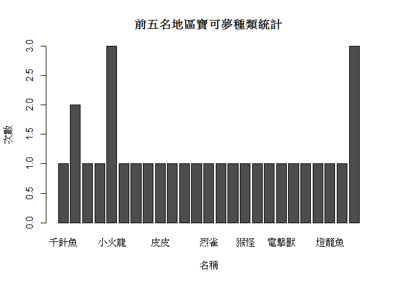

README
================

題目
----

玩寶可夢真的那麼危險？

資料介紹與來源
--------------

●A2\_record是事故類別：A2類的交通資料紀錄，A2的意思是交通事故當事人一人以上受傷(不管事輕傷或重傷)或超過24小時後死亡。 ●pokemon2 pokemontype 是全台各縣市寶可夢巢穴名稱及地點和CP值。 ●內政部警政署 (車禍事故資料) ●<http://kikinote.net/article/115309.html> (寶可夢資料) ●[http://www.otaku-hk.com/news/Pokemon-Go-%E5%B0%8F%E7%B2%BE%E9%9D%88%E6%95%B8%E6%93%9A%E8%AA%BF%E6%95%B4%E7%B8%BD%E8%A1%A8(CP,-%E6%94%BB%E5%8F%8A%E9%98%B2%E8%AE%8A%E5%8C%96)/412-1(寶可夢資料)](http://www.otaku-hk.com/news/Pokemon-Go-%E5%B0%8F%E7%B2%BE%E9%9D%88%E6%95%B8%E6%93%9A%E8%AA%BF%E6%95%B4%E7%B8%BD%E8%A1%A8(CP,-%E6%94%BB%E5%8F%8A%E9%98%B2%E8%AE%8A%E5%8C%96)/412-1(寶可夢資料))

格式
----

Excel檔案及網頁內容

分析議題
--------

●寶可夢GO是一款基於位置服務的擴增實境類手機遊戲，由任天堂公司、精靈寶可夢公司授權，Niantic, Inc.負責開發和營運。於2016年7月起在iOS和Android平台上發布。該遊戲允許玩家以現實世界為平台，捕捉、戰鬥、訓練和交易虛擬怪獸「寶可夢」。 ●台灣去年也盛行一時，因而產生一些問題，像是有些虛擬怪物會出現在特別的地方(例如：海邊、山區等等偏僻處)，使玩家會讓自己深入危險處，也有一些玩家會一邊開(騎)車一邊抓寶，以上問題皆可能造成自身安全受害。

假設
----

●自始Pokemon Go盛行，政府一再呼籲民眾玩樂之餘也要注意交通安全，卻仍在新聞媒體層出不窮出現因為玩寶可夢而致使交通打結的景況，欲藉由此期末專題了解交通是否因為寶可夢的盛行而有所影響，受傷人數多的區域是否皆為相同的寶可夢。 ●寶可夢是從105/08/06開始開放台灣下載的，因此假設是從該日期開始事故率逐漸提升。

分析結果
--------

●資料匯入

``` r
library(readxl)
```

    ## Warning: package 'readxl' was built under R version 3.3.3

``` r
A2_record2 <- read_excel("C:/Users/user/Desktop/A2 record2.xlsx", 
    skip = 2)
```

    ## Warning in read_fun(path = path, sheet = sheet, limits = limits, shim =
    ## shim, : Expecting numeric in E145012 / R145012C5: got '頝舫�餈�(��)'

    ## Warning in read_fun(path = path, sheet = sheet, limits = limits, shim =
    ## shim, : Expecting numeric in E177678 / R177678C5: got '��)(��)'

    ## Warning in read_fun(path = path, sheet = sheet, limits = limits, shim =
    ## shim, : Expecting numeric in E201565 / R201565C5: got '��)'

    ## Warning in read_fun(path = path, sheet = sheet, limits = limits, shim =
    ## shim, : Expecting numeric in E260891 / R260891C5: got '摰�銵�139撌�(��)'

    ## Warning in read_fun(path = path, sheet = sheet, limits = limits, shim =
    ## shim, : Expecting numeric in E267664 / R267664C5: got '�楝��(��)'

    ## Warning in read_fun(path = path, sheet = sheet, limits = limits, shim =
    ## shim, : Expecting numeric in E282330 / R282330C5: got '銝€銵(��)'

``` r
#View(A2_record2)

library(readxl)
pokemon2 <- read_excel("C:/Users/user/Desktop/pokemon2.xlsx")
#View(pokemon2)

library(readxl)
pokemontype <- read_excel("C:/Users/user/Desktop/pokemontype.xlsx")
#View(pokemontype)
```

●抓出行政區資料

``` r
library(dplyr)
```

    ## Warning: package 'dplyr' was built under R version 3.3.3

    ## 
    ## Attaching package: 'dplyr'

    ## The following objects are masked from 'package:stats':
    ## 
    ##     filter, lag

    ## The following objects are masked from 'package:base':
    ## 
    ##     intersect, setdiff, setequal, union

``` r
A2 <- A2_record2[grepl("區",A2_record2$發生地點),]
```

●統計車禍紀錄中前五多的受傷人數地區

``` r
library(dplyr)
SumofHurt <- group_by(A2, place=`發生地點`)%>%
              summarise(ninjuries=sum(`受傷人數`))%>%
      arrange(desc(ninjuries))

#install.packages("ggplot2")
library(ggplot2)
```

    ## Warning: package 'ggplot2' was built under R version 3.3.3

``` r
rank<-head(SumofHurt,decreasing = TRUE,5)
#install.packages("tidyr")
library(tidyr)
```

    ## Warning: package 'tidyr' was built under R version 3.3.3

``` r
A<-spread(rank,key=place,value=ninjuries)
barplot(as.matrix(A),width =1,space=0.2,main="前五名受傷人數",xlab="地區名稱",ylab="受傷人數")
```

 ●根據前五多地區將該地區巢穴資料合併

``` r
no1<-pokemon2[grepl("高雄市三民區",pokemon2$巢穴地址),]
no2<-pokemon2[grepl("臺中市西屯區",pokemon2$巢穴地址),]
no3<-pokemon2[grepl("高雄市鳳山區",pokemon2$巢穴地址),]
no4<-pokemon2[grepl("桃園市桃園區",pokemon2$巢穴地址),]
no5<-pokemon2[grepl("新北市板橋區",pokemon2$巢穴地址),]
topfive<-rbind(no1,no2,no3,no4,no5)
SumofType<- group_by(topfive, name=`寶可夢名稱`)%>%
              summarise(ntype=n())%>%
      arrange(name)
W<-spread(SumofType,key=name,value=ntype)
barplot(as.matrix(W),width =10,space=0.2,main="前五名地區寶可夢種類統計",xlab="名稱",ylab="次數")
```

 ●統計每日事故量(折線圖與散布圖) -互動式圖表用於觀察單一日期之事故數量。(互動式圖表可詳見於html檔案) -散步圖上畫上趨勢線。

``` r
SumofTime <- group_by(A2, day=`發生日期`)%>%
              summarise(ncount=n())%>%
      arrange(day)
B<-spread(SumofTime,key=day,value=ncount)

qplot(x=day,                               
      y=ncount,                              
      data=SumofTime,                      
      geom="point",                         # 圖形=scatter plot
      main = "每日統計",  
      xlab="Date",                          
      ylab="發生次數"                          # 以顏色標註月份，複合式的散布圖
      )
```


``` r
library(plotly)
```

    ## Warning: package 'plotly' was built under R version 3.3.3

    ## 
    ## Attaching package: 'plotly'

    ## The following object is masked from 'package:ggplot2':
    ## 
    ##     last_plot

    ## The following object is masked from 'package:stats':
    ## 
    ##     filter

    ## The following object is masked from 'package:graphics':
    ## 
    ##     layout

``` r
ggplotly()
```

    ## We recommend that you use the dev version of ggplot2 with `ggplotly()`
    ## Install it with: `devtools::install_github('hadley/ggplot2')`

<!--html_preserve-->

<script type="application/json" data-for="24e838d853e9">{"x":{"data":[{"x":[1,2,3,4,5,6,7,8,9,10,11,12,13,14,15,16,17,18,19,20,21,22,23,24,25,26,27,28,29,30,31,32,33,34,35,36,37,38,39,40,41,42,43,44,45,46,47,48,49,50,51,52,53,54,55,56,57,58,59,60,61,62,63,64,65,66,67,68,69,70,71,72,73,74,75,76,77,78,79,80,81,82,83,84,85,86,87,88,89,90,91,92,93,94,95,96,97,98,99,100,101,102,103,104,105,106,107,108,109,110,111,112,113,114,115,116,117,118,119,120,121,122,123,124,125,126,127,128,129,130,131,132,133,134,135,136,137,138,139,140,141,142,143,144,145,146,147,148,149,150,151,152,153,154,155,156,157,158,159,160,161,162,163,164,165,166,167,168,169,170,171,172,173,174,175,176,177,178,179,180,181,182,183,184,185,186,187,188,189,190,191,192,193,194,195,196,197,198,199,200,201,202,203,204,205,206,207,208,209,210,211,212,213,214,215,216,217,218,219,220,221,222,223,224,225,226,227,228,229,230,231,232,233,234,235,236,237,238,239,240,241,242,243,244,245,246,247,248,249,250,251,252,253,254,255,256,257,258,259,260,261,262,263,264,265,266,267,268,269,270,271,272,273,274,275,276,277,278,279,280,281,282,283,284,285,286,287,288,289,290,291,292,293,294,295,296,297,298,299,300,301,302,303,304,305,306,307,308,309,310,311,312,313,314,315,316,317,318,319,320,321,322,323,324,325,326,327,328,329,330,331,332,333,334,335,336,337,338,339,340,341,342,343,344,345,346,347,348,349,350,351,352,353,354,355,356,357,358,359,360,361,362,363,364,365,366],"y":[661,563,517,707,713,782,712,753,727,545,757,795,709,684,799,680,434,753,657,682,601,722,553,464,718,713,628,577,588,544,429,812,709,796,788,832,601,461,362,394,404,399,444,571,423,729,623,628,592,622,539,455,649,600,611,621,625,518,506,473,738,742,693,700,590,552,636,609,689,774,767,535,484,621,579,560,568,597,458,419,596,649,639,671,734,662,478,643,618,516,527,679,568,493,475,514,731,683,718,471,510,655,641,633,625,630,603,439,596,689,619,616,609,526,468,560,535,584,593,661,486,465,580,762,683,687,797,659,482,707,753,612,614,724,578,508,629,634,591,619,614,544,439,609,597,548,585,625,524,408,548,616,758,646,829,792,580,701,760,773,522,488,464,510,629,595,674,707,735,601,495,686,617,636,627,636,629,463,630,587,520,534,726,616,510,753,739,565,666,260,539,414,622,659,660,670,685,568,432,611,628,608,648,650,536,455,597,581,598,553,528,439,372,617,640,602,573,674,569,424,622,580,628,573,589,472,444,579,559,550,520,572,549,435,549,507,518,517,552,423,329,530,469,454,645,690,621,544,680,590,610,617,713,618,561,693,733,513,440,503,402,454,593,601,651,605,650,640,453,648,203,364,565,581,610,516,591,678,656,724,807,541,428,476,706,623,674,637,617,555,642,616,628,598,669,537,476,630,520,589,518,594,517,432,470,714,723,666,768,658,517,678,688,656,721,750,572,550,626,634,651,645,684,604,504,609,705,626,691,662,565,411,605,567,573,709,733,667,551,695,623,700,779,623,795,592,759,826,750,701,791,730,605,762,775,717,663,771,637,566,652,684,782,565,624,532],"text":["day: 105/01/01<br />ncount: 661","day: 105/01/02<br />ncount: 563","day: 105/01/03<br />ncount: 517","day: 105/01/04<br />ncount: 707","day: 105/01/05<br />ncount: 713","day: 105/01/06<br />ncount: 782","day: 105/01/07<br />ncount: 712","day: 105/01/08<br />ncount: 753","day: 105/01/09<br />ncount: 727","day: 105/01/10<br />ncount: 545","day: 105/01/11<br />ncount: 757","day: 105/01/12<br />ncount: 795","day: 105/01/13<br />ncount: 709","day: 105/01/14<br />ncount: 684","day: 105/01/15<br />ncount: 799","day: 105/01/16<br />ncount: 680","day: 105/01/17<br />ncount: 434","day: 105/01/18<br />ncount: 753","day: 105/01/19<br />ncount: 657","day: 105/01/20<br />ncount: 682","day: 105/01/21<br />ncount: 601","day: 105/01/22<br />ncount: 722","day: 105/01/23<br />ncount: 553","day: 105/01/24<br />ncount: 464","day: 105/01/25<br />ncount: 718","day: 105/01/26<br />ncount: 713","day: 105/01/27<br />ncount: 628","day: 105/01/28<br />ncount: 577","day: 105/01/29<br />ncount: 588","day: 105/01/30<br />ncount: 544","day: 105/01/31<br />ncount: 429","day: 105/02/01<br />ncount: 812","day: 105/02/02<br />ncount: 709","day: 105/02/03<br />ncount: 796","day: 105/02/04<br />ncount: 788","day: 105/02/05<br />ncount: 832","day: 105/02/06<br />ncount: 601","day: 105/02/07<br />ncount: 461","day: 105/02/08<br />ncount: 362","day: 105/02/09<br />ncount: 394","day: 105/02/10<br />ncount: 404","day: 105/02/11<br />ncount: 399","day: 105/02/12<br />ncount: 444","day: 105/02/13<br />ncount: 571","day: 105/02/14<br />ncount: 423","day: 105/02/15<br />ncount: 729","day: 105/02/16<br />ncount: 623","day: 105/02/17<br />ncount: 628","day: 105/02/18<br />ncount: 592","day: 105/02/19<br />ncount: 622","day: 105/02/20<br />ncount: 539","day: 105/02/21<br />ncount: 455","day: 105/02/22<br />ncount: 649","day: 105/02/23<br />ncount: 600","day: 105/02/24<br />ncount: 611","day: 105/02/25<br />ncount: 621","day: 105/02/26<br />ncount: 625","day: 105/02/27<br />ncount: 518","day: 105/02/28<br />ncount: 506","day: 105/02/29<br />ncount: 473","day: 105/03/01<br />ncount: 738","day: 105/03/02<br />ncount: 742","day: 105/03/03<br />ncount: 693","day: 105/03/04<br />ncount: 700","day: 105/03/05<br />ncount: 590","day: 105/03/06<br />ncount: 552","day: 105/03/07<br />ncount: 636","day: 105/03/08<br />ncount: 609","day: 105/03/09<br />ncount: 689","day: 105/03/10<br />ncount: 774","day: 105/03/11<br />ncount: 767","day: 105/03/12<br />ncount: 535","day: 105/03/13<br />ncount: 484","day: 105/03/14<br />ncount: 621","day: 105/03/15<br />ncount: 579","day: 105/03/16<br />ncount: 560","day: 105/03/17<br />ncount: 568","day: 105/03/18<br />ncount: 597","day: 105/03/19<br />ncount: 458","day: 105/03/20<br />ncount: 419","day: 105/03/21<br />ncount: 596","day: 105/03/22<br />ncount: 649","day: 105/03/23<br />ncount: 639","day: 105/03/24<br />ncount: 671","day: 105/03/25<br />ncount: 734","day: 105/03/26<br />ncount: 662","day: 105/03/27<br />ncount: 478","day: 105/03/28<br />ncount: 643","day: 105/03/29<br />ncount: 618","day: 105/03/30<br />ncount: 516","day: 105/03/31<br />ncount: 527","day: 105/04/01<br />ncount: 679","day: 105/04/02<br />ncount: 568","day: 105/04/03<br />ncount: 493","day: 105/04/04<br />ncount: 475","day: 105/04/05<br />ncount: 514","day: 105/04/06<br />ncount: 731","day: 105/04/07<br />ncount: 683","day: 105/04/08<br />ncount: 718","day: 105/04/09<br />ncount: 471","day: 105/04/10<br />ncount: 510","day: 105/04/11<br />ncount: 655","day: 105/04/12<br />ncount: 641","day: 105/04/13<br />ncount: 633","day: 105/04/14<br />ncount: 625","day: 105/04/15<br />ncount: 630","day: 105/04/16<br />ncount: 603","day: 105/04/17<br />ncount: 439","day: 105/04/18<br />ncount: 596","day: 105/04/19<br />ncount: 689","day: 105/04/20<br />ncount: 619","day: 105/04/21<br />ncount: 616","day: 105/04/22<br />ncount: 609","day: 105/04/23<br />ncount: 526","day: 105/04/24<br />ncount: 468","day: 105/04/25<br />ncount: 560","day: 105/04/26<br />ncount: 535","day: 105/04/27<br />ncount: 584","day: 105/04/28<br />ncount: 593","day: 105/04/29<br />ncount: 661","day: 105/04/30<br />ncount: 486","day: 105/05/01<br />ncount: 465","day: 105/05/02<br />ncount: 580","day: 105/05/03<br />ncount: 762","day: 105/05/04<br />ncount: 683","day: 105/05/05<br />ncount: 687","day: 105/05/06<br />ncount: 797","day: 105/05/07<br />ncount: 659","day: 105/05/08<br />ncount: 482","day: 105/05/09<br />ncount: 707","day: 105/05/10<br />ncount: 753","day: 105/05/11<br />ncount: 612","day: 105/05/12<br />ncount: 614","day: 105/05/13<br />ncount: 724","day: 105/05/14<br />ncount: 578","day: 105/05/15<br />ncount: 508","day: 105/05/16<br />ncount: 629","day: 105/05/17<br />ncount: 634","day: 105/05/18<br />ncount: 591","day: 105/05/19<br />ncount: 619","day: 105/05/20<br />ncount: 614","day: 105/05/21<br />ncount: 544","day: 105/05/22<br />ncount: 439","day: 105/05/23<br />ncount: 609","day: 105/05/24<br />ncount: 597","day: 105/05/25<br />ncount: 548","day: 105/05/26<br />ncount: 585","day: 105/05/27<br />ncount: 625","day: 105/05/28<br />ncount: 524","day: 105/05/29<br />ncount: 408","day: 105/05/30<br />ncount: 548","day: 105/05/31<br />ncount: 616","day: 105/06/01<br />ncount: 758","day: 105/06/02<br />ncount: 646","day: 105/06/03<br />ncount: 829","day: 105/06/04<br />ncount: 792","day: 105/06/05<br />ncount: 580","day: 105/06/06<br />ncount: 701","day: 105/06/07<br />ncount: 760","day: 105/06/08<br />ncount: 773","day: 105/06/09<br />ncount: 522","day: 105/06/10<br />ncount: 488","day: 105/06/11<br />ncount: 464","day: 105/06/12<br />ncount: 510","day: 105/06/13<br />ncount: 629","day: 105/06/14<br />ncount: 595","day: 105/06/15<br />ncount: 674","day: 105/06/16<br />ncount: 707","day: 105/06/17<br />ncount: 735","day: 105/06/18<br />ncount: 601","day: 105/06/19<br />ncount: 495","day: 105/06/20<br />ncount: 686","day: 105/06/21<br />ncount: 617","day: 105/06/22<br />ncount: 636","day: 105/06/23<br />ncount: 627","day: 105/06/24<br />ncount: 636","day: 105/06/25<br />ncount: 629","day: 105/06/26<br />ncount: 463","day: 105/06/27<br />ncount: 630","day: 105/06/28<br />ncount: 587","day: 105/06/29<br />ncount: 520","day: 105/06/30<br />ncount: 534","day: 105/07/01<br />ncount: 726","day: 105/07/02<br />ncount: 616","day: 105/07/03<br />ncount: 510","day: 105/07/04<br />ncount: 753","day: 105/07/05<br />ncount: 739","day: 105/07/06<br />ncount: 565","day: 105/07/07<br />ncount: 666","day: 105/07/08<br />ncount: 260","day: 105/07/09<br />ncount: 539","day: 105/07/10<br />ncount: 414","day: 105/07/11<br />ncount: 622","day: 105/07/12<br />ncount: 659","day: 105/07/13<br />ncount: 660","day: 105/07/14<br />ncount: 670","day: 105/07/15<br />ncount: 685","day: 105/07/16<br />ncount: 568","day: 105/07/17<br />ncount: 432","day: 105/07/18<br />ncount: 611","day: 105/07/19<br />ncount: 628","day: 105/07/20<br />ncount: 608","day: 105/07/21<br />ncount: 648","day: 105/07/22<br />ncount: 650","day: 105/07/23<br />ncount: 536","day: 105/07/24<br />ncount: 455","day: 105/07/25<br />ncount: 597","day: 105/07/26<br />ncount: 581","day: 105/07/27<br />ncount: 598","day: 105/07/28<br />ncount: 553","day: 105/07/29<br />ncount: 528","day: 105/07/30<br />ncount: 439","day: 105/07/31<br />ncount: 372","day: 105/08/01<br />ncount: 617","day: 105/08/02<br />ncount: 640","day: 105/08/03<br />ncount: 602","day: 105/08/04<br />ncount: 573","day: 105/08/05<br />ncount: 674","day: 105/08/06<br />ncount: 569","day: 105/08/07<br />ncount: 424","day: 105/08/08<br />ncount: 622","day: 105/08/09<br />ncount: 580","day: 105/08/10<br />ncount: 628","day: 105/08/11<br />ncount: 573","day: 105/08/12<br />ncount: 589","day: 105/08/13<br />ncount: 472","day: 105/08/14<br />ncount: 444","day: 105/08/15<br />ncount: 579","day: 105/08/16<br />ncount: 559","day: 105/08/17<br />ncount: 550","day: 105/08/18<br />ncount: 520","day: 105/08/19<br />ncount: 572","day: 105/08/20<br />ncount: 549","day: 105/08/21<br />ncount: 435","day: 105/08/22<br />ncount: 549","day: 105/08/23<br />ncount: 507","day: 105/08/24<br />ncount: 518","day: 105/08/25<br />ncount: 517","day: 105/08/26<br />ncount: 552","day: 105/08/27<br />ncount: 423","day: 105/08/28<br />ncount: 329","day: 105/08/29<br />ncount: 530","day: 105/08/30<br />ncount: 469","day: 105/08/31<br />ncount: 454","day: 105/09/01<br />ncount: 645","day: 105/09/02<br />ncount: 690","day: 105/09/03<br />ncount: 621","day: 105/09/04<br />ncount: 544","day: 105/09/05<br />ncount: 680","day: 105/09/06<br />ncount: 590","day: 105/09/07<br />ncount: 610","day: 105/09/08<br />ncount: 617","day: 105/09/09<br />ncount: 713","day: 105/09/10<br />ncount: 618","day: 105/09/11<br />ncount: 561","day: 105/09/12<br />ncount: 693","day: 105/09/13<br />ncount: 733","day: 105/09/14<br />ncount: 513","day: 105/09/15<br />ncount: 440","day: 105/09/16<br />ncount: 503","day: 105/09/17<br />ncount: 402","day: 105/09/18<br />ncount: 454","day: 105/09/19<br />ncount: 593","day: 105/09/20<br />ncount: 601","day: 105/09/21<br />ncount: 651","day: 105/09/22<br />ncount: 605","day: 105/09/23<br />ncount: 650","day: 105/09/24<br />ncount: 640","day: 105/09/25<br />ncount: 453","day: 105/09/26<br />ncount: 648","day: 105/09/27<br />ncount: 203","day: 105/09/28<br />ncount: 364","day: 105/09/29<br />ncount: 565","day: 105/09/30<br />ncount: 581","day: 105/10/01<br />ncount: 610","day: 105/10/02<br />ncount: 516","day: 105/10/03<br />ncount: 591","day: 105/10/04<br />ncount: 678","day: 105/10/05<br />ncount: 656","day: 105/10/06<br />ncount: 724","day: 105/10/07<br />ncount: 807","day: 105/10/08<br />ncount: 541","day: 105/10/09<br />ncount: 428","day: 105/10/10<br />ncount: 476","day: 105/10/11<br />ncount: 706","day: 105/10/12<br />ncount: 623","day: 105/10/13<br />ncount: 674","day: 105/10/14<br />ncount: 637","day: 105/10/15<br />ncount: 617","day: 105/10/16<br />ncount: 555","day: 105/10/17<br />ncount: 642","day: 105/10/18<br />ncount: 616","day: 105/10/19<br />ncount: 628","day: 105/10/20<br />ncount: 598","day: 105/10/21<br />ncount: 669","day: 105/10/22<br />ncount: 537","day: 105/10/23<br />ncount: 476","day: 105/10/24<br />ncount: 630","day: 105/10/25<br />ncount: 520","day: 105/10/26<br />ncount: 589","day: 105/10/27<br />ncount: 518","day: 105/10/28<br />ncount: 594","day: 105/10/29<br />ncount: 517","day: 105/10/30<br />ncount: 432","day: 105/10/31<br />ncount: 470","day: 105/11/01<br />ncount: 714","day: 105/11/02<br />ncount: 723","day: 105/11/03<br />ncount: 666","day: 105/11/04<br />ncount: 768","day: 105/11/05<br />ncount: 658","day: 105/11/06<br />ncount: 517","day: 105/11/07<br />ncount: 678","day: 105/11/08<br />ncount: 688","day: 105/11/09<br />ncount: 656","day: 105/11/10<br />ncount: 721","day: 105/11/11<br />ncount: 750","day: 105/11/12<br />ncount: 572","day: 105/11/13<br />ncount: 550","day: 105/11/14<br />ncount: 626","day: 105/11/15<br />ncount: 634","day: 105/11/16<br />ncount: 651","day: 105/11/17<br />ncount: 645","day: 105/11/18<br />ncount: 684","day: 105/11/19<br />ncount: 604","day: 105/11/20<br />ncount: 504","day: 105/11/21<br />ncount: 609","day: 105/11/22<br />ncount: 705","day: 105/11/23<br />ncount: 626","day: 105/11/24<br />ncount: 691","day: 105/11/25<br />ncount: 662","day: 105/11/26<br />ncount: 565","day: 105/11/27<br />ncount: 411","day: 105/11/28<br />ncount: 605","day: 105/11/29<br />ncount: 567","day: 105/11/30<br />ncount: 573","day: 105/12/01<br />ncount: 709","day: 105/12/02<br />ncount: 733","day: 105/12/03<br />ncount: 667","day: 105/12/04<br />ncount: 551","day: 105/12/05<br />ncount: 695","day: 105/12/06<br />ncount: 623","day: 105/12/07<br />ncount: 700","day: 105/12/08<br />ncount: 779","day: 105/12/09<br />ncount: 623","day: 105/12/10<br />ncount: 795","day: 105/12/11<br />ncount: 592","day: 105/12/12<br />ncount: 759","day: 105/12/13<br />ncount: 826","day: 105/12/14<br />ncount: 750","day: 105/12/15<br />ncount: 701","day: 105/12/16<br />ncount: 791","day: 105/12/17<br />ncount: 730","day: 105/12/18<br />ncount: 605","day: 105/12/19<br />ncount: 762","day: 105/12/20<br />ncount: 775","day: 105/12/21<br />ncount: 717","day: 105/12/22<br />ncount: 663","day: 105/12/23<br />ncount: 771","day: 105/12/24<br />ncount: 637","day: 105/12/25<br />ncount: 566","day: 105/12/26<br />ncount: 652","day: 105/12/27<br />ncount: 684","day: 105/12/28<br />ncount: 782","day: 105/12/29<br />ncount: 565","day: 105/12/30<br />ncount: 624","day: 105/12/31<br />ncount: 532"],"type":"scatter","mode":"markers","marker":{"autocolorscale":false,"color":"rgba(0,0,0,1)","opacity":1,"size":5.66929133858268,"symbol":"circle","line":{"width":1.88976377952756,"color":"rgba(0,0,0,1)"}},"hoveron":"points","showlegend":false,"xaxis":"x","yaxis":"y","hoverinfo":"text","frame":null}],"layout":{"margin":{"t":43.7625570776256,"r":7.30593607305936,"b":40.1826484018265,"l":43.1050228310502},"plot_bgcolor":"rgba(235,235,235,1)","paper_bgcolor":"rgba(255,255,255,1)","font":{"color":"rgba(0,0,0,1)","family":"","size":14.6118721461187},"title":"每日統計","titlefont":{"color":"rgba(0,0,0,1)","family":"","size":17.5342465753425},"xaxis":{"domain":[0,1],"type":"linear","autorange":false,"tickmode":"array","range":[0.4,366.6],"ticktext":["105/01/01","105/01/02","105/01/03","105/01/04","105/01/05","105/01/06","105/01/07","105/01/08","105/01/09","105/01/10","105/01/11","105/01/12","105/01/13","105/01/14","105/01/15","105/01/16","105/01/17","105/01/18","105/01/19","105/01/20","105/01/21","105/01/22","105/01/23","105/01/24","105/01/25","105/01/26","105/01/27","105/01/28","105/01/29","105/01/30","105/01/31","105/02/01","105/02/02","105/02/03","105/02/04","105/02/05","105/02/06","105/02/07","105/02/08","105/02/09","105/02/10","105/02/11","105/02/12","105/02/13","105/02/14","105/02/15","105/02/16","105/02/17","105/02/18","105/02/19","105/02/20","105/02/21","105/02/22","105/02/23","105/02/24","105/02/25","105/02/26","105/02/27","105/02/28","105/02/29","105/03/01","105/03/02","105/03/03","105/03/04","105/03/05","105/03/06","105/03/07","105/03/08","105/03/09","105/03/10","105/03/11","105/03/12","105/03/13","105/03/14","105/03/15","105/03/16","105/03/17","105/03/18","105/03/19","105/03/20","105/03/21","105/03/22","105/03/23","105/03/24","105/03/25","105/03/26","105/03/27","105/03/28","105/03/29","105/03/30","105/03/31","105/04/01","105/04/02","105/04/03","105/04/04","105/04/05","105/04/06","105/04/07","105/04/08","105/04/09","105/04/10","105/04/11","105/04/12","105/04/13","105/04/14","105/04/15","105/04/16","105/04/17","105/04/18","105/04/19","105/04/20","105/04/21","105/04/22","105/04/23","105/04/24","105/04/25","105/04/26","105/04/27","105/04/28","105/04/29","105/04/30","105/05/01","105/05/02","105/05/03","105/05/04","105/05/05","105/05/06","105/05/07","105/05/08","105/05/09","105/05/10","105/05/11","105/05/12","105/05/13","105/05/14","105/05/15","105/05/16","105/05/17","105/05/18","105/05/19","105/05/20","105/05/21","105/05/22","105/05/23","105/05/24","105/05/25","105/05/26","105/05/27","105/05/28","105/05/29","105/05/30","105/05/31","105/06/01","105/06/02","105/06/03","105/06/04","105/06/05","105/06/06","105/06/07","105/06/08","105/06/09","105/06/10","105/06/11","105/06/12","105/06/13","105/06/14","105/06/15","105/06/16","105/06/17","105/06/18","105/06/19","105/06/20","105/06/21","105/06/22","105/06/23","105/06/24","105/06/25","105/06/26","105/06/27","105/06/28","105/06/29","105/06/30","105/07/01","105/07/02","105/07/03","105/07/04","105/07/05","105/07/06","105/07/07","105/07/08","105/07/09","105/07/10","105/07/11","105/07/12","105/07/13","105/07/14","105/07/15","105/07/16","105/07/17","105/07/18","105/07/19","105/07/20","105/07/21","105/07/22","105/07/23","105/07/24","105/07/25","105/07/26","105/07/27","105/07/28","105/07/29","105/07/30","105/07/31","105/08/01","105/08/02","105/08/03","105/08/04","105/08/05","105/08/06","105/08/07","105/08/08","105/08/09","105/08/10","105/08/11","105/08/12","105/08/13","105/08/14","105/08/15","105/08/16","105/08/17","105/08/18","105/08/19","105/08/20","105/08/21","105/08/22","105/08/23","105/08/24","105/08/25","105/08/26","105/08/27","105/08/28","105/08/29","105/08/30","105/08/31","105/09/01","105/09/02","105/09/03","105/09/04","105/09/05","105/09/06","105/09/07","105/09/08","105/09/09","105/09/10","105/09/11","105/09/12","105/09/13","105/09/14","105/09/15","105/09/16","105/09/17","105/09/18","105/09/19","105/09/20","105/09/21","105/09/22","105/09/23","105/09/24","105/09/25","105/09/26","105/09/27","105/09/28","105/09/29","105/09/30","105/10/01","105/10/02","105/10/03","105/10/04","105/10/05","105/10/06","105/10/07","105/10/08","105/10/09","105/10/10","105/10/11","105/10/12","105/10/13","105/10/14","105/10/15","105/10/16","105/10/17","105/10/18","105/10/19","105/10/20","105/10/21","105/10/22","105/10/23","105/10/24","105/10/25","105/10/26","105/10/27","105/10/28","105/10/29","105/10/30","105/10/31","105/11/01","105/11/02","105/11/03","105/11/04","105/11/05","105/11/06","105/11/07","105/11/08","105/11/09","105/11/10","105/11/11","105/11/12","105/11/13","105/11/14","105/11/15","105/11/16","105/11/17","105/11/18","105/11/19","105/11/20","105/11/21","105/11/22","105/11/23","105/11/24","105/11/25","105/11/26","105/11/27","105/11/28","105/11/29","105/11/30","105/12/01","105/12/02","105/12/03","105/12/04","105/12/05","105/12/06","105/12/07","105/12/08","105/12/09","105/12/10","105/12/11","105/12/12","105/12/13","105/12/14","105/12/15","105/12/16","105/12/17","105/12/18","105/12/19","105/12/20","105/12/21","105/12/22","105/12/23","105/12/24","105/12/25","105/12/26","105/12/27","105/12/28","105/12/29","105/12/30","105/12/31"],"tickvals":[1,2,3,4,5,6,7,8,9,10,11,12,13,14,15,16,17,18,19,20,21,22,23,24,25,26,27,28,29,30,31,32,33,34,35,36,37,38,39,40,41,42,43,44,45,46,47,48,49,50,51,52,53,54,55,56,57,58,59,60,61,62,63,64,65,66,67,68,69,70,71,72,73,74,75,76,77,78,79,80,81,82,83,84,85,86,87,88,89,90,91,92,93,94,95,96,97,98,99,100,101,102,103,104,105,106,107,108,109,110,111,112,113,114,115,116,117,118,119,120,121,122,123,124,125,126,127,128,129,130,131,132,133,134,135,136,137,138,139,140,141,142,143,144,145,146,147,148,149,150,151,152,153,154,155,156,157,158,159,160,161,162,163,164,165,166,167,168,169,170,171,172,173,174,175,176,177,178,179,180,181,182,183,184,185,186,187,188,189,190,191,192,193,194,195,196,197,198,199,200,201,202,203,204,205,206,207,208,209,210,211,212,213,214,215,216,217,218,219,220,221,222,223,224,225,226,227,228,229,230,231,232,233,234,235,236,237,238,239,240,241,242,243,244,245,246,247,248,249,250,251,252,253,254,255,256,257,258,259,260,261,262,263,264,265,266,267,268,269,270,271,272,273,274,275,276,277,278,279,280,281,282,283,284,285,286,287,288,289,290,291,292,293,294,295,296,297,298,299,300,301,302,303,304,305,306,307,308,309,310,311,312,313,314,315,316,317,318,319,320,321,322,323,324,325,326,327,328,329,330,331,332,333,334,335,336,337,338,339,340,341,342,343,344,345,346,347,348,349,350,351,352,353,354,355,356,357,358,359,360,361,362,363,364,365,366],"ticks":"outside","tickcolor":"rgba(51,51,51,1)","ticklen":3.65296803652968,"tickwidth":0.66417600664176,"showticklabels":true,"tickfont":{"color":"rgba(77,77,77,1)","family":"","size":11.689497716895},"tickangle":-0,"showline":false,"linecolor":null,"linewidth":0,"showgrid":true,"gridcolor":"rgba(255,255,255,1)","gridwidth":0.66417600664176,"zeroline":false,"anchor":"y","title":"Date","titlefont":{"color":"rgba(0,0,0,1)","family":"","size":14.6118721461187},"hoverformat":".2f"},"yaxis":{"domain":[0,1],"type":"linear","autorange":false,"tickmode":"array","range":[171.55,863.45],"ticktext":["200","400","600","800"],"tickvals":[200,400,600,800],"ticks":"outside","tickcolor":"rgba(51,51,51,1)","ticklen":3.65296803652968,"tickwidth":0.66417600664176,"showticklabels":true,"tickfont":{"color":"rgba(77,77,77,1)","family":"","size":11.689497716895},"tickangle":-0,"showline":false,"linecolor":null,"linewidth":0,"showgrid":true,"gridcolor":"rgba(255,255,255,1)","gridwidth":0.66417600664176,"zeroline":false,"anchor":"x","title":"發生次數","titlefont":{"color":"rgba(0,0,0,1)","family":"","size":14.6118721461187},"hoverformat":".2f"},"shapes":[{"type":"rect","fillcolor":null,"line":{"color":null,"width":0,"linetype":[]},"yref":"paper","xref":"paper","x0":0,"x1":1,"y0":0,"y1":1}],"showlegend":false,"legend":{"bgcolor":"rgba(255,255,255,1)","bordercolor":"transparent","borderwidth":1.88976377952756,"font":{"color":"rgba(0,0,0,1)","family":"","size":11.689497716895}},"hovermode":"closest","width":672,"height":480},"source":"A","attrs":{"24e81b5d6b89":{"x":{},"y":{},"type":"ggplotly"}},"cur_data":"24e81b5d6b89","visdat":{"24e81b5d6b89":["function (y) ","x"]},"config":{"modeBarButtonsToAdd":[{"name":"Collaborate","icon":{"width":1000,"ascent":500,"descent":-50,"path":"M487 375c7-10 9-23 5-36l-79-259c-3-12-11-23-22-31-11-8-22-12-35-12l-263 0c-15 0-29 5-43 15-13 10-23 23-28 37-5 13-5 25-1 37 0 0 0 3 1 7 1 5 1 8 1 11 0 2 0 4-1 6 0 3-1 5-1 6 1 2 2 4 3 6 1 2 2 4 4 6 2 3 4 5 5 7 5 7 9 16 13 26 4 10 7 19 9 26 0 2 0 5 0 9-1 4-1 6 0 8 0 2 2 5 4 8 3 3 5 5 5 7 4 6 8 15 12 26 4 11 7 19 7 26 1 1 0 4 0 9-1 4-1 7 0 8 1 2 3 5 6 8 4 4 6 6 6 7 4 5 8 13 13 24 4 11 7 20 7 28 1 1 0 4 0 7-1 3-1 6-1 7 0 2 1 4 3 6 1 1 3 4 5 6 2 3 3 5 5 6 1 2 3 5 4 9 2 3 3 7 5 10 1 3 2 6 4 10 2 4 4 7 6 9 2 3 4 5 7 7 3 2 7 3 11 3 3 0 8 0 13-1l0-1c7 2 12 2 14 2l218 0c14 0 25-5 32-16 8-10 10-23 6-37l-79-259c-7-22-13-37-20-43-7-7-19-10-37-10l-248 0c-5 0-9-2-11-5-2-3-2-7 0-12 4-13 18-20 41-20l264 0c5 0 10 2 16 5 5 3 8 6 10 11l85 282c2 5 2 10 2 17 7-3 13-7 17-13z m-304 0c-1-3-1-5 0-7 1-1 3-2 6-2l174 0c2 0 4 1 7 2 2 2 4 4 5 7l6 18c0 3 0 5-1 7-1 1-3 2-6 2l-173 0c-3 0-5-1-8-2-2-2-4-4-4-7z m-24-73c-1-3-1-5 0-7 2-2 3-2 6-2l174 0c2 0 5 0 7 2 3 2 4 4 5 7l6 18c1 2 0 5-1 6-1 2-3 3-5 3l-174 0c-3 0-5-1-7-3-3-1-4-4-5-6z"},"click":"function(gd) { \n        // is this being viewed in RStudio?\n        if (location.search == '?viewer_pane=1') {\n          alert('To learn about plotly for collaboration, visit:\\n https://cpsievert.github.io/plotly_book/plot-ly-for-collaboration.html');\n        } else {\n          window.open('https://cpsievert.github.io/plotly_book/plot-ly-for-collaboration.html', '_blank');\n        }\n      }"}],"cloud":false},"highlight":{"on":"plotly_click","persistent":false,"dynamic":false,"selectize":false,"opacityDim":0.2,"selected":{"opacity":1}},"base_url":"https://plot.ly"},"evals":["config.modeBarButtonsToAdd.0.click"],"jsHooks":{"render":[{"code":"function(el, x) { var ctConfig = crosstalk.var('plotlyCrosstalkOpts').set({\"on\":\"plotly_click\",\"persistent\":false,\"dynamic\":false,\"selectize\":false,\"opacityDim\":0.2,\"selected\":{\"opacity\":1}}); }","data":null}]}}</script>
<!--/html_preserve-->
``` r
SumofTime$day<-c(1:366)
#SumofTime$day<-as.Date(as.character(SumofTime$day), format="%Y%m%d")
plot(SumofTime,type="l",xlab="Date",ylab="發生次數",main="每日統計",xlim=c(1,366),ylim = c(300,900))
```


``` r
qplot(day, ncount, 
       data = SumofTime,
       geom = c("point", "smooth"))
```

    ## `geom_smooth()` using method = 'loess'

 \#\#分析結果可能解決的問題 根據前五多地區多方宣導寶可夢之相關安全事宜。

組員名單與分工
--------------

●李士閎：找資料(50%)、CODE(55%)、書面彙整(50%)、上台簡報製作(45%)。 ●林宇辰：找資料(50%)、CODE(45%)、書面彙整(50%)、上台簡報製作(55%)。
